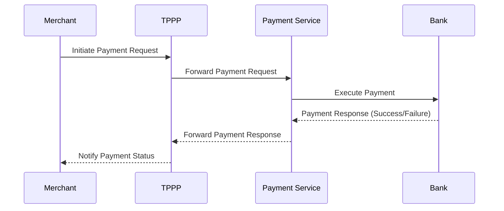
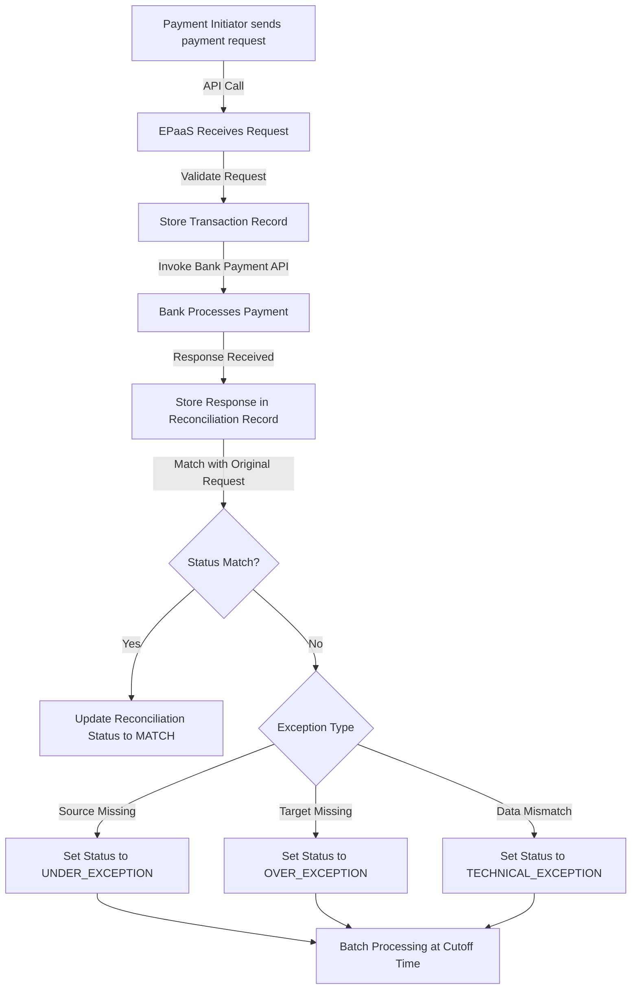
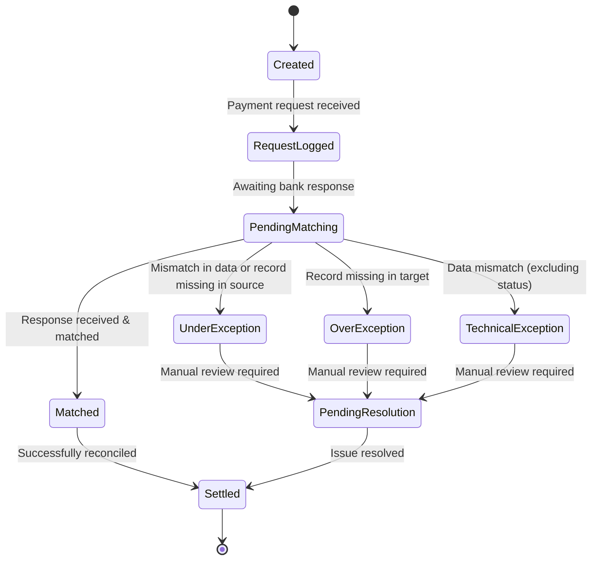
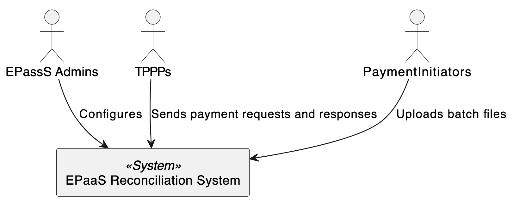
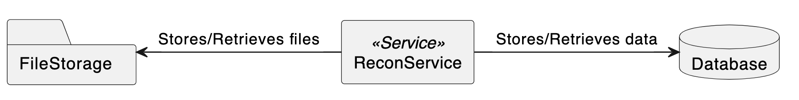
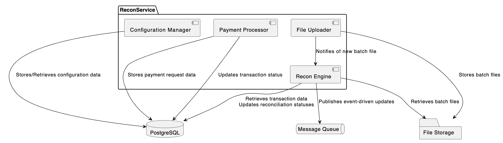
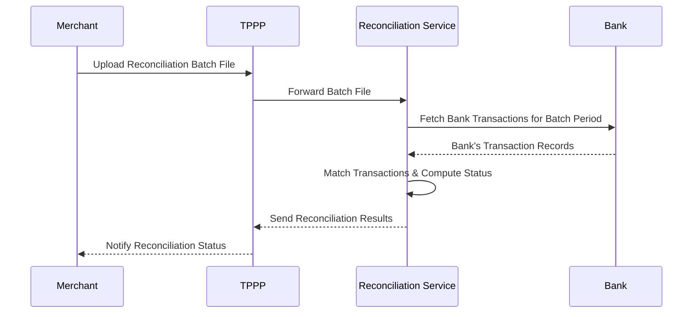
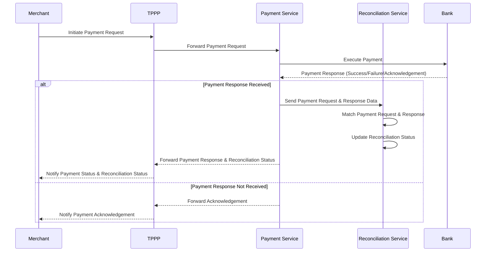
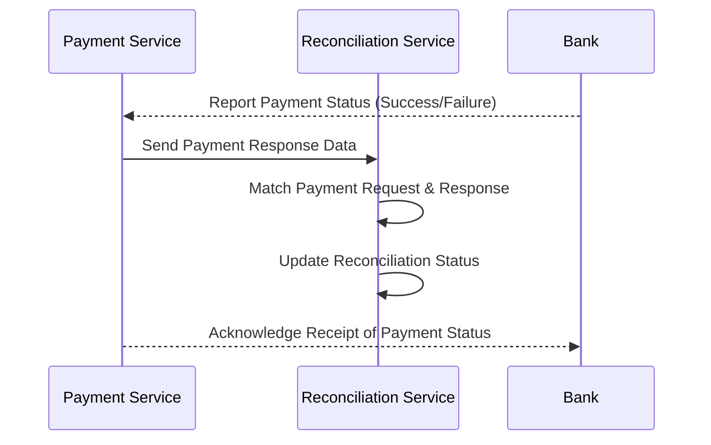

# EPaaS Payment Reconciliation


##  Functional Overview
EPaaS is a Payment Platform offered by the Bank to Third Party Payment Providers (TPPPs). TPPPs use their own APIs that are used to invoke EPaaS APIs, which in-turn execute the Bank’s Payment APIs.

The purpose of the Reconciliation is to ensure that the transactions executed by the TPPP match the transactions executed by the Bank and the EPaaS platform has an always accurate view in order to carry out daily settlement (payment to the TPPP).


### Basic Payment Process

This diagram illustrates the basic interactions between Merchants, Third-Party Payment Providers (TPPPs), EPaaS, and the Bank during payment process.




### Reconciliation Workflow
The following diagram represents how a reconciliation process is performed.




### Reconciliation Record Lifecycle
The following diagram depicts the lifecycle of a reconciliation record.



## Technical Architecture

### System Context Diagram
Here's the high-level view of the solution, depicting the EPaaS Reconciliation System and its interactions with external entities.


### Container Diagram
The following diagram depicts the deployable units, such as services, databases, and file storage systems.

It consists of several key containers:
- **ReconService**: Central service handling configuration, payment request processing, transaction response matching, and batch file uploads.
- **Database**: Stores transaction data (payment requests, responses, and reconciliation records), using PostgreSQL for relational data management. This database will also store audit logs for compliance purposes.
- **FileStorage**: Manages batch transaction files, potentially using local file systems or cloud storage like Amazon S3 for scalability.

### Component Diagram
The following diagram depicts the components of the ReconService, and their interactions with each other and other containers.


It consists of several key components:
- **ConfigurationManager**: Manages batch schedules and configuration, interacting with the Database.
- **PaymentProcessor**: Handles incoming payment requests, storing them in the Database. Also processes transaction responses, updating statuses in the Database.
- **FileUploader**: Manages batch file uploads, storing files in FileStorage and notifying the ReconEngine.
- **ReconEngine**: Performs reconciliation, retrieving data from Database and FileStorage, and updating statuses.

### Data Model
The following diagram depicts the data model of the Payment and Reconciliation scenarios.


The key tables are described below:
- **payments**: Stores all the payment details such as the payment ID, bank reference ID, amount, currency, payment method, and the current status of the payment.

- **recon_batches**: Holds information about reconciliation batch processing, which define the time window during which the reconciliation occurs (start time, end time, batch status).

- **reconciliations**: Stores the result of the reconciliation process, which includes the matching status (MATCH, UNDER_EXCEPTION, OVER_EXCEPTION) and any error details if there are exceptions.

- **merchants**: Represents the merchants who use the EPaaS platform, containing details such as their name, email, and phone number.

- **tppps**: Represents the Third-Party Payment Providers (TPPPs) interacting with the platform.


### Tech Stack
- **Microservices:** Java, Spring Boot, Spring Security
- **Database:** PostgreSQL
- **Message Queue:** Apache Kafka
- **File Storage:** AWS S3 to store batch files
- **Authentication & Security:** API Key, Mutual TLS  
- **API Gateway:** As per standards
- **Logging & Monitoring:** As per standards


### NFRs, SLAs & Compliances
- **Scalability:** Kafka ensures high-throughput event processing  
- **Extensibility:** Schema design allows future expansion  
- **Performance:** Optimized DB queries & batch processing  
- **Security:** Compliant with banking-grade security standards  
- **Audit Logging:** Every reconciliation event is logged and tamper-proof  
- **Encryption:** AES-256 for data at rest, TLS 1.3 for data in transit  
- **Access Controls:** Role-based access control (RBAC)  


### Batch Reconciliation Process
Reconciliation is performed immediately upon receiving payment response from the Bank.
This diagram illustrates the API interactions between Merchants, Third-Party Payment Providers (TPPPs), EPaaS, and the Bank during batch reconciliation process.




## API Specifications for EPaaS Reconciliation System
This section outlines the API specifications for the EPaaS (Enterprise Payments as a Service) platform. The APIs are designed to facilitate seamless integration between payment initiators (Third-Party Payment Providers - TPPPs) and the Bank's payment system.

### PaymentService (/payment)

This API is invoked by the TPPP APIs to make a payment through EPaaS. It invokes the Bank API in order to perform a payment. Reconciliation is triggered if a payment success/failure is received immediately from the Bank. Otherwise, the acknowledgement received from the Bank is forwarded to the TPPP.



| **Description** |  |
|---------------|----------------------------|
| **Base URL** | `https://epaas.com/api/v1` | 
| **Method** | POST |
| **Action** | `/payment` | 
| **Authentication** | API Key (`x-api-key`) |
| **Content-Type** | `application/json` |


#### **API Request Sample**
```json
{
  "paymentId": "1234567890",
  "merchantId": "M1001",
  "tpppId": "TPPP2001",
  "amount": {
    "currency": "INR",
    "value": 1500.00
  },
  "payer": {
    "name": "John Doe",
    "accountNumber": "123456789012",
    "ifsc": "HDFC0001234"
  },
  "payee": {
    "name": "XYZ Pvt Ltd",
    "accountNumber": "987654321012",
    "ifsc": "ICIC0005678"
  },
  "metadata": {
    "orderId": "ORD10001",
    "invoiceId": "INV56789",
    "description": "Payment for Order #ORD10001",
    "timestamp": "2025-03-30T10:15:30Z"
  }
}
```

#### **API Response Codes**
| Status Code | Meaning | Description |
|--------------|------------|----------------|
| `200` | Success | Request processed successfully |
| `202` | Accepted | Request accepted, processing in progress |
| `400` | Bad Request | Invalid request parameters |
| `401` | Unauthorized | Authentication failed |
| `403` | Forbidden | Authorization failed |
| `404` | Not Found | Resource does not exist |
| `500` | Server Error | Processing error |


#### **API Response Samples**

**Success Case (200 OK)**
```json
{
  "paymentId": "1234567890",
  "status": "SUCCESS",
  "bankReferenceId": "BANK56789",
  "settlementTime": "2025-03-30T10:16:40Z",
  "message": "Payment processed successfully",
  "reconciliationStatus": "MATCH",
  "timestamp": "2025-03-30T10:16:45Z"
}
```

**Failure Case (500 Internal Server Error)**
```json
{
  "paymentId": "1234567890",
  "status": "FAILED",
  "errorCode": "BANK_TXN_TIMEOUT",
  "errorMessage": "Transaction timed out at bank",
  "reconciliationStatus": "TECHNICAL_EXCEPTION",
  "timestamp": "2025-03-30T10:16:40Z"
}
```

**Pending (202 Accepted)**
```json
{
  "paymentId": "1234567890",
  "status": "PENDING",
  "message": "Payment request received, processing in progress",
  "expectedCompletionTime": "2025-03-30T10:16:30Z",
  "timestamp": "2025-03-30T10:15:30Z"
}
```
#### **Task breakdown and estimates**
| Task | Complexity | Estimated Time (hrs) |
|------|-------------|-----------------------|
| Backend API for Payment | Medium | 16 |
| API Testing | Simple | 4 |
| Integration Testing | Medium | 8 |
| Deployment | Simple | 2 |


### PaymentService (/payment/callback)

This API is invoked by the Bank to report the completion status of a payment. It will trigger the reconciliation process and update the payment status.



| **Description** |  |
|---------------|----------------------------|
| **Base URL** | `https://epaas.com/api/v1` | 
| **Method** | POST |
| **Action** | `/payment/callback` | 
| **Authentication** | API Key (`x-api-key`) |
| **Content-Type** | `application/json` |


#### **API Request Sample**
```json
{
  "paymentId": "1234567890",
  "bankReferenceId": "BANK56789",
  "status": "SUCCESS",  // or "FAILED"
  "transactionDetails": {
    "amount": {
      "currency": "INR",
      "value": 1500.00
    },
    "settlementTime": "2025-03-30T10:16:30Z",
    "transactionTimestamp": "2025-03-30T10:16:00Z"
  },
  "errorDetails": {
    "errorCode": "BANK_TXN_TIMEOUT",  // optional if status is "FAILED"
    "errorMessage": "Transaction timed out at bank"  // optional if status is "FAILED"
  }
}
```

#### **API Response Codes**
| Status Code | Meaning | Description |
|--------------|------------|----------------|
| `200` | Success | Request processed successfully |
| `400` | Bad Request | Invalid request parameters |
| `401` | Unauthorized | Authentication failed |
| `403` | Forbidden | Authorization failed |
| `404` | Not Found | Resource does not exist |
| `500` | Server Error | Processing error |


#### **API Response Samples**
**Success Case (200 OK)**
```json
{
  "paymentId": "1234567890",
  "status": "RECEIVED",
  "message": "Payment status successfully received",
  "timestamp": "2025-03-30T10:16:50Z"
}
```

#### **Task breakdown and estimates**
| Task | Complexity | Estimated Time (hrs) |
|------|-------------|-----------------------|
| Backend API for Payment Callback | Medium | 16 |
| API Testing | Simple | 4 |
| Integration Testing | Medium | 8 |
| Deployment | Simple | 2 |
