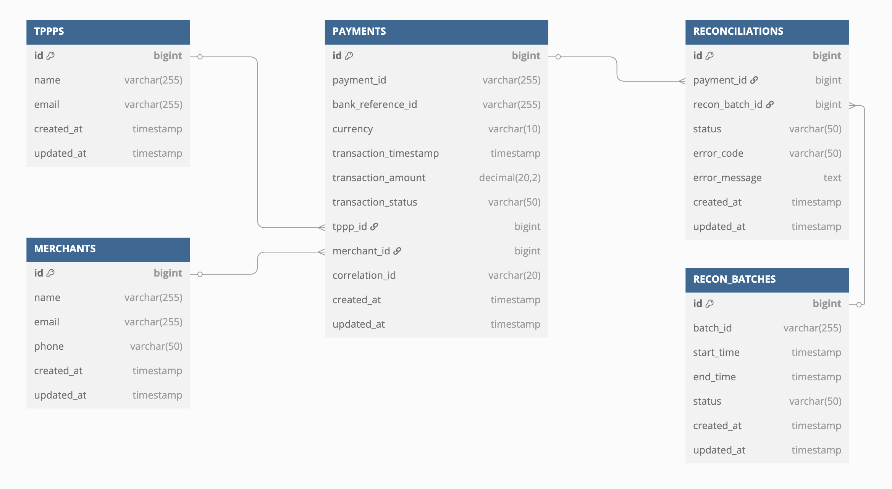

# EPaaS Payment Reconciliation


##  Functional Overview
EPaaS is a Payment Platform offered by the Bank to Third Party Payment Providers (TPPPs). TPPPs use their own APIs that are used to invoke EPaaS APIs, which in-turn execute the Bank’s Payment APIs.

The purpose of the Reconciliation is to ensure that the transactions executed by the TPPP match the transactions executed by the Bank and the EPaaS platform has an always accurate view in order to carry out daily settlement (payment to the TPPP).


### Basic Payment Process

This diagram illustrates the simplified interactions between Merchants, Third-Party Payment Providers (TPPPs), EPaaS, and the Bank during payment process.


### Reconciliation Workflow
The following diagram represents how a reconciliation process is performed.


### Reconciliation Record Lifecycle
The following diagram depicts the lifecycle of a reconciliation record.


## Technical Design

### Technical Architecture
Here's the high-level view of the solution, depicting the EPaaS Reconciliation System and its interactions with external entities.


It consists of several key components:
- **Payment API**: Handles incoming payment requests, and sends payment events to the **Payment-Requests topic**. This service also processes transaction responses, that are posted to the **Payment-Responses topic**.
- **Recon API**: Handles incoming reconciliation requests, and sends reconciliation events to the **Recon-Events topic**. This API also manages batch file uploads for on-demand reconciliation, storing files in FileStorage and then sends reconciliation events to the **Recon-Events topic**.
- **Config API**: Handles configuration of reconciliation parameters and other settings such as rate limits.
- **Payment Processor**: Consumes messages from **Payment-Requests topic**, updates the database and dispatches the request to the bank system. If a payment response is received immediately, then it posts a message to the **Recon-Events topic**. This processor also consumes messages from **Payment-Responses topic**. Then updates the database with the payment status and posts a message to the **Recon-Events topic**.
- **Recon Processor**: Performs reconciliation of single events or batches, based on transaction request & response matching.
- **Database**: Stores transaction data (payment requests, responses, and reconciliation records), using PostgreSQL for relational data management. This database also stores audit logs for compliance purposes.
- **File Storage**: Stores batch transaction files on Amazon S3 for scalability.
- **Misc Utils**: Contains utility classes for common operations such as file upload, date utils, audit logging, and error handling.


### Data Model
The following diagram depicts the data model of the Payment and Reconciliation scenarios.


Ref: https://dbdiagram.io/d/67e9a2954f7afba184bc42ba

The key tables are described below:
- **PAYMENTS**: Stores all the payment details such as the payment ID, bank reference ID, amount, currency, payment method, and the current status of the payment.

- **RECON_BATCHES**: Holds information about reconciliation batch processing, which define the time window during which the reconciliation occurs (start time, end time, batch status).

- **RECONCILIATIONS**: Stores the result of the reconciliation process, which includes the matching status (MATCH, UNDER_EXCEPTION, OVER_EXCEPTION) and any error details if there are exceptions.

- **MERCHANTS**: Represents the merchants who use the EPaaS platform, containing details such as their name, email, and phone number.

- **TPPPS**: Represents the Third-Party Payment Providers (TPPPs) interacting with the platform.


### Tech Stack
- **Microservices:** Java, Spring Boot, Spring Security
- **Database:** Amazon RDS (PostgreSQL)
- **Message Queue:** Apache Kafka
- **File Storage:** AWS S3 to store batch files
- **Cache:** Memcached
- **Authentication & Security:** API Key, Mutual TLS
- **API Gateway:** As per standards
- **Logging & Monitoring:** As per standards
- **Deployment:** Kubernetes, Docker
- **Liquibase**: Database changeset management

### NFRs, SLAs & Compliances
- **Scalability:** Kafka and Kubernetes ensures high-throughput and horizontal scalability
- **Extensibility:** Schema and API design allows future expansion of features
- **Performance:** Optimized DB queries & batch processing
- **Security:** Compliant with banking security standards
- **Audit Logging:** Every payment and reconciliation event is logged for reference
- **Encryption:** AES-256 for data at rest, TLS 1.3 for data in transit
- **Access Controls:** API key based access control


## API Specifications for EPaaS Reconciliation System
This section outlines the API specifications for the EPaaS (Enterprise Payments as a Service) platform. The APIs are designed to facilitate seamless integration between payment initiators (Third-Party Payment Providers - TPPPs) and the Bank's payment system.

### Payment API (/payment)

This API is invoked by the TPPP APIs to make a payment through EPaaS. It invokes the Bank API in order to perform a payment. Reconciliation flow is triggered if a payment success/failure is received immediately from the Bank. Otherwise, the acknowledgement received from the Bank is forwarded to the TPPP.


| **Description** |  |
|---------------|----------------------------|
| **Base URL** | `https://epaas.com/api/v1` | 
| **Method** | POST |
| **Action** | `/payment` | 
| **Authentication** | API Key (`x-api-key`) |
| **Content-Type** | `application/json` |


#### **API Request Sample**
```json
{
  "paymentId": "1234567890",
  "merchantId": "M1001",
  "tpppId": "TPPP2001",
  "correlationId": "CORR12345",
  "amount": {
    "currency": "INR",
    "value": 1500.00
  },
  "payer": {
    "name": "John Doe",
    "accountNumber": "123456789012",
    "ifsc": "HDFC0001234"
  },
  "payee": {
    "name": "XYZ Pvt Ltd",
    "accountNumber": "987654321012",
    "ifsc": "ICIC0005678"
  },
  "metadata": {
    "orderId": "ORD10001",
    "invoiceId": "INV56789",
    "description": "Payment for Order #ORD10001",
    "timestamp": "2025-03-30T10:15:30Z"
  }
}
```

#### **API Response Codes**
| Status Code | Meaning | Description |
|--------------|------------|----------------|
| `202` | Accepted | Request accepted, processing in progress |
| `400` | Bad Request | Invalid request parameters |
| `401` | Unauthorized | Authentication failed |
| `403` | Forbidden | Authorization failed |
| `404` | Not Found | Resource does not exist |
| `500` | Server Error | Processing error |


#### **API Response Samples**

**Pending (202 Accepted)**
```json
{
  "paymentId": "1234567890",
  "status": "PENDING",
  "message": "Payment request received, processing in progress",
  "expectedCompletionTime": "2025-03-30T10:16:30Z",
  "timestamp": "2025-03-30T10:15:30Z"
}
```

#### **Task breakdown and estimates**
| Task | Complexity | Estimated Time (hrs) |
|------|-------------|-----------------------|
| Backend API for Payment | Complex | 32 |
| API Testing | Medium | 8 |
| Integration Testing | Medium | 8 |
| Config & Deployment | Simple | 4 |

**Total Estimate: 52 hours**


### PaymentService (/payment/callback)

This API is invoked by the Bank to report the completion status of a payment. It will trigger the reconciliation process and update the payment status.


| **Description** |  |
|---------------|----------------------------|
| **Base URL** | `https://epaas.com/api/v1` | 
| **Method** | POST |
| **Action** | `/payment/callback` | 
| **Authentication** | API Key (`x-api-key`) |
| **Content-Type** | `application/json` |


#### **API Request Sample**
```json
{
  "paymentId": "1234567890",
  "bankReferenceId": "BANK56789",
  "status": "SUCCESS",  // or "FAILED"
  "transactionDetails": {
    "amount": {
      "currency": "INR",
      "value": 1500.00
    },
    "settlementTime": "2025-03-30T10:16:30Z",
    "transactionTimestamp": "2025-03-30T10:16:00Z"
  },
  "errorDetails": {
    "errorCode": "BANK_TXN_TIMEOUT",  // optional if status is "FAILED"
    "errorMessage": "Transaction timed out at bank"  // optional if status is "FAILED"
  }
}
```

#### **API Response Codes**
| Status Code | Meaning | Description |
|--------------|------------|----------------|
| `200` | Success | Request processed successfully |
| `400` | Bad Request | Invalid request parameters |
| `401` | Unauthorized | Authentication failed |
| `403` | Forbidden | Authorization failed |
| `404` | Not Found | Resource does not exist |
| `500` | Server Error | Processing error |


#### **API Response Samples**
**Success Case (200 OK)**
```json
{
  "paymentId": "1234567890",
  "status": "RECEIVED",
  "message": "Payment status successfully received",
  "timestamp": "2025-03-30T10:16:50Z"
}
```

#### **Task breakdown and estimates**
| Task | Complexity | Estimated Time (hrs) |
|------|-------------|-----------------------|
| Backend API for Payment Callback | Complex | 24 |
| API Testing | Medium | 8 |
| Integration Testing | Medium | 8 |
| Config & Deployment | Simple | 4 |

**Total Estimate: 44 hours**

## API Performance Testing
- Simulate normal load.
- Simulate peak load.
- Increase API calls beyond peak load until failures occur.
- Monitor API response times and resource usage.
- Check how Kubernetes auto-scales new microservice instances.
- Validate Kafka partitions and consumer scaling.
- Check PostgreSQL query times and performance.
- Test caching effectiveness - with and without MemCached

## CI/CD Architecture
TODO: Add diagram and description
- Docker images are built and pushed to AWS ECR
- SonarQube & TwistLock scans code & images for vulnerabilities
- SonarQube, OWASP Dependency-Check & TwistLock scans code, dependencies & docker images for vulnerabilities
- Automated unit tests are run on each commit, integration tests are run on each PR, code coverage thresholds are enforced for PR merges
- Renovate bot updates dependencies and creates PRs for dependency upgrades
- Helm Charts deploy microservices on Kubernetes cluster on AWS Virtual Machines
- Auto-scaling policies are applied based on CPU and memory usage, and also based on custom metrics.
- Configurations are managed using ConfigMaps and AWS Secrets Manager
- Rolling deployments ensure zero downtime
- Compliance checks with AWS Security Hub
- Compliance checks with AWS Security Hub

## Governance Plan for Engineering Teams
- Automated checks in CI/CD pipelines.
- Regular technical walkthroughs.
- L2 code reviews to ensure the code adheres to architectural guidelines, naming conventions, and design patterns.
- API contract validation.
- Review integration and system test reports.
- Review performance test reports.
- Deployment and production validation.
- Review audit logs and logs from monitoring tools.