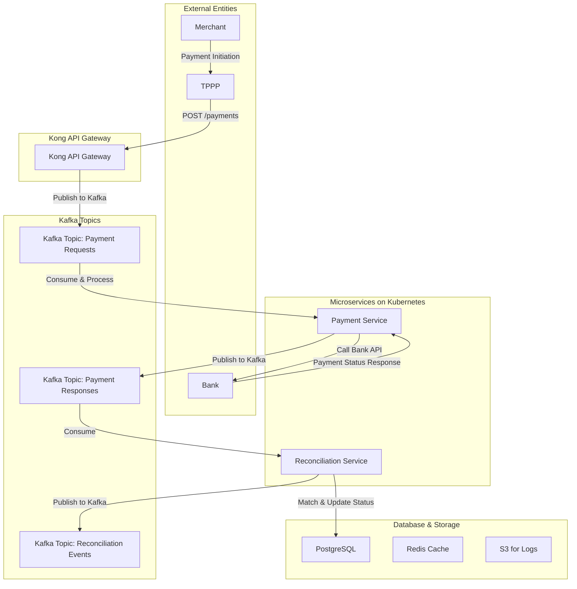
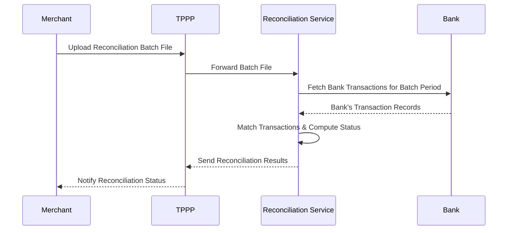

**Success Case (200 OK)**
```json
{
  "paymentId": "1234567890",
  "status": "SUCCESS",
  "bankReferenceId": "BANK56789",
  "settlementTime": "2025-03-30T10:16:40Z",
  "message": "Payment processed successfully",
  "reconciliationStatus": "MATCH",
  "timestamp": "2025-03-30T10:16:45Z"
}
```

**Failure Case (500 Internal Server Error)**
```json
{
  "paymentId": "1234567890",
  "status": "FAILED",
  "errorCode": "BANK_TXN_TIMEOUT",
  "errorMessage": "Transaction timed out at bank",
  "reconciliationStatus": "TECHNICAL_EXCEPTION",
  "timestamp": "2025-03-30T10:16:40Z"
}
```

### Batch Reconciliation Process
Reconciliation is performed immediately upon receiving payment response from the Bank.
This diagram illustrates the API interactions between Merchants, Third-Party Payment Providers (TPPPs), EPaaS, and the Bank during batch reconciliation process.


